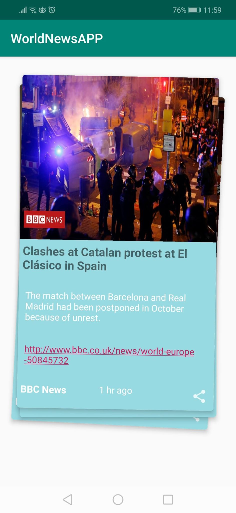
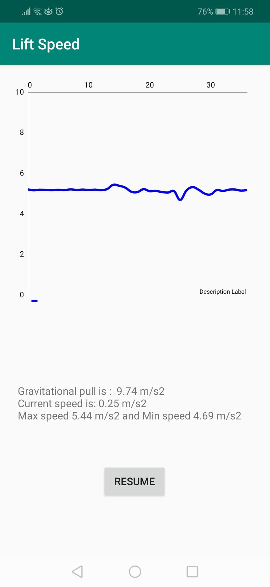
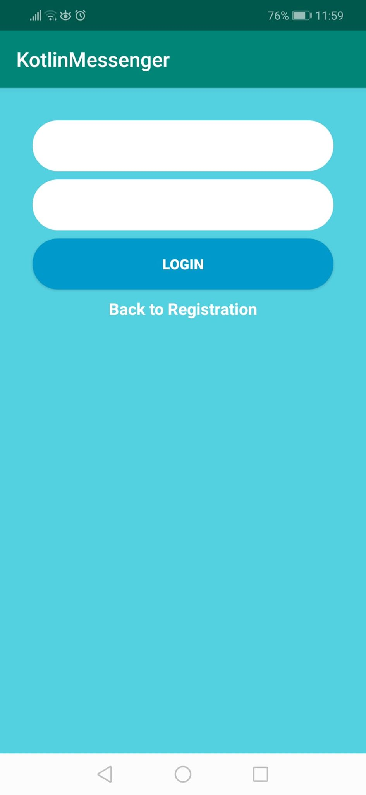
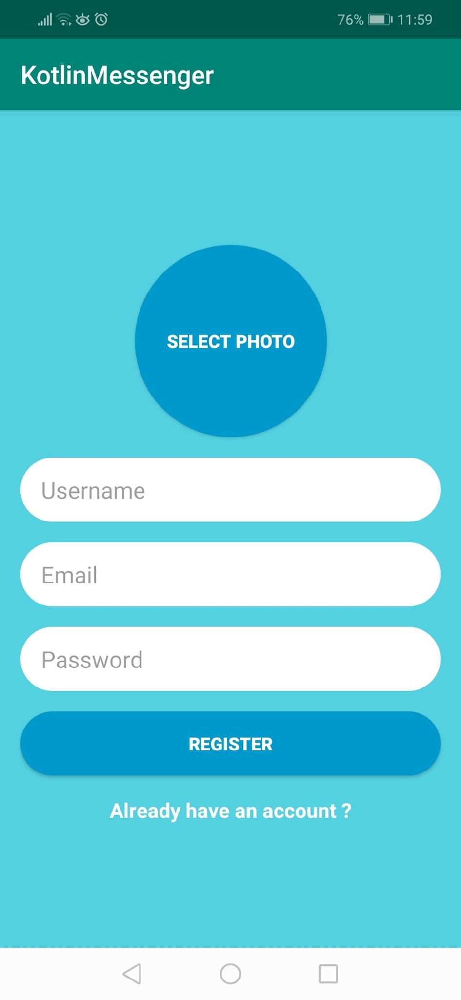

---app demos---
 
<h><b>News app</b></h>

pull data from api, present it, swipe function

 

 
<h><b>Speed calculator</b></h>

tapping into sensors and graphing it live, working with threads to pause and resume

 

 
<h><b>Messenger app</b></h>

multi view app, firebase backend, login register etc

 

  

     
  

